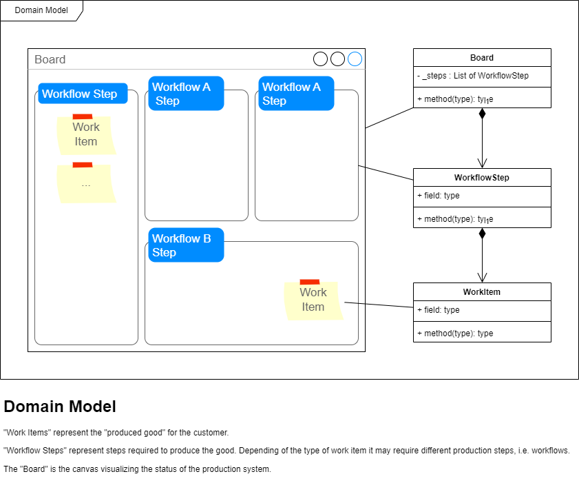

# ITerative Metrics

[](https://github.com/psf/black)

Use cases:

- Count number of work items on our team kanban board
- Create a cumulative flow diagram for our team metrics



## Usage Guide

The software requires python3. You need some basic python programming experience to use the software.

You run the [main.py](src/iterative_metrics/main.py) script to execute the program - details are given below. If you run it from the command line, then a window showing the diagram will open. Press `q` to close the window.

If you run [main.py](src/iterative_metrics/main.py) from JetBrains PyCharm with **Scientific Mode** enabled in the **View** menu, then you can copy-paste the diagram.

### Install dependencies

```shell
pip install -r requirements.txt
```

### Install package in editable mode

```shell
pip install --editable .
```

### Count work_items on screenshot of a kanban board

- Replace the file [kanban_board.png](client-data/kanban_board.png) with a current screenshot of the kanban board

```shell
python src/iterative_metrics/main.py
```

### Render Cumulative Flow Diagram

#### Update input data

- Edit the file [cumulative_flow_diagram.py](src/iterative_metrics/adapters/inbound/cumulative_flow_diagram.py)
- Append a row with the next date to the variable `dates`
- Append the data from the board to every array in the `metrics` map
- Save the file
- Make a commit with message "feat: metrics for today"

#### Render CFD

```shell
python src/iterative_metrics/main.py
```

## Development Guide

### Run the tests

```shell
python -m pytest
```

### Build package

```shell
python -m build
```
